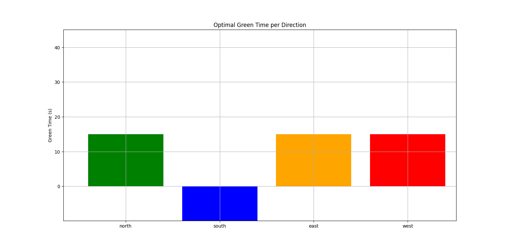

# Traffic Light Timing Optimization

This project applies **Linear Programming** to optimize traffic light timings at a busy intersection. The goal is to **minimize the average vehicle delay** while ensuring fair and efficient flow for all directions.

## 🚦 Problem Statement

Urban intersections often suffer from inefficient signal timings, leading to:
- Increased delays and congestion
- Excessive fuel consumption
- Elevated emissions

This project uses mathematical modeling to improve traffic signal efficiency by dynamically allocating green time based on traffic flow in each direction.

## 📊 Objective

To **maximize the weighted sum of green times**, giving higher priority to directions with higher traffic flow.

## 🧠 Mathematical Model

### Variables
- `n`: Number of directions (e.g., 4 – North, South, East, West)
- `gᵢ`: Green time for direction *i*
- `c`: Total cycle length
- `qᵢ`, `sᵢ`: Flow and saturation rates for direction *i*
- `y`: Yellow transition time

### Objective Function
Maximize Z = ∑ (qᵢ × gᵢ) for i = 1 to n

### Constraints
- Green + Yellow Time = Total Cycle Time
- Capacity constraints for each direction
- Bounds on green time and cycle length

## 🛠️ Tools & Technologies

- **Python 3.13**
- **PuLP** – Linear programming solver
- **NumPy** – Numerical computations
- **Matplotlib** – Data visualization

## 🧪 Sample Output

The script prompts user input for traffic parameters and calculates:
- Optimal green times per direction
- Overall cycle time
- Delays per direction using **Webster's Formula**
- Bar chart visualization of green time allocation

## 📈 Visualization

The output includes a bar chart showing green time allocations based on traffic flow rates.

---
